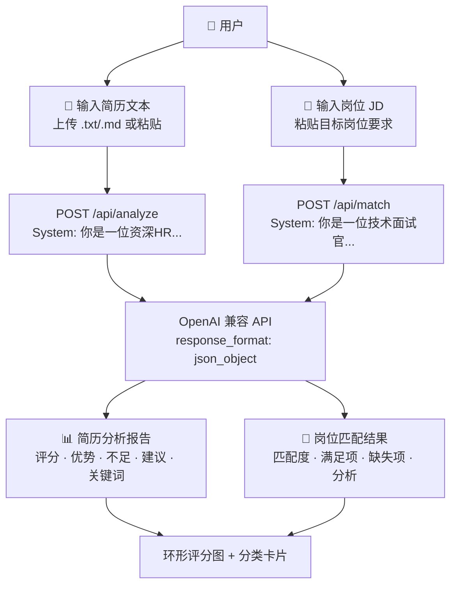

# 🎯 AI 简历优化 & 岗位匹配平台

上传简历，AI 智能分析优劣 + 匹配目标岗位要求，输出优化建议和匹配度评分。

## 🏗 架构



## ✨ 功能

| 功能 | 说明 |
|------|------|
| 📝 **智能简历分析** | AI 从 HR 视角分析简历，给出 0-100 综合评分 |
| 🎯 **岗位匹配** | 对比简历与 JD，计算匹配度，列出满足/缺失的技能 |
| 💡 **优化建议** | 针对薄弱环节给出具体改进方向 |
| 🏷 **关键词提取** | 自动提取简历中的技术栈和核心能力 |

## 🚀 快速开始

```bash
# 安装依赖
npm install

# 配置 API Key
echo "OPENAI_API_KEY=sk-your-key" > .env.local
echo "OPENAI_BASE_URL=" >> .env.local    # 使用代理时填写
echo "MODEL_NAME=gpt-3.5-turbo" >> .env.local

# 启动
npm run dev
# → http://localhost:3000
```

## 🛠 技术栈

| 层 | 技术 |
|----|------|
| **框架** | Next.js 15 (App Router) |
| **语言** | TypeScript |
| **AI** | OpenAI 兼容 API (Structured JSON 输出) |
| **UI** | React 19 + CSS-in-JS |
| **部署** | Vercel |

## 📡 API

| 方法 | 路径 | 说明 |
|------|------|------|
| `POST` | `/api/analyze` | 分析简历 → `{score, strengths, weaknesses, suggestions, keywords}` |
| `POST` | `/api/match` | 匹配岗位 → `{score, matched[], missing[], analysis}` |

## 🎨 特性

- **纯前端 + API Route**：无需单独后端服务
- **Structured JSON 输出**：LLM 返回结构化数据，前端精确渲染
- **GitHub Dark 主题**：专业开发者风格
- **一键部署 Vercel**：零配置

## 📁 项目结构

```text
app/
├── layout.tsx              # 根布局
├── page.tsx                # 主页面（分析 + 匹配）
└── api/
    ├── analyze/route.ts    # 简历分析 API
    └── match/route.ts      # 岗位匹配 API

lib/
└── llm.ts                  # LLM 客户端封装
```

## 📝 License

MIT
